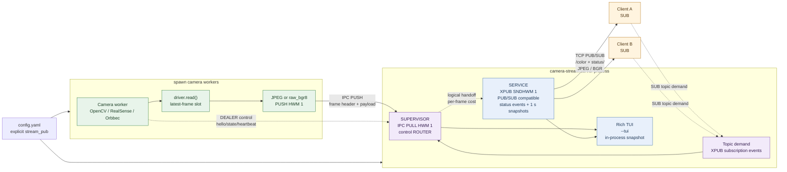

# camera-stream

> [!TIP]
> ## camera-stream | Project Card
>
> **camera-stream** is a lightweight Linux multi-camera streaming service. It
> broadcasts local camera images over ZeroMQ for trusted internal networks,
> designed for real-time-first machine-vision and robotics workloads where the
> newest frame is more valuable than retaining every frame.
>
> | Core capability | Design |
> | --- | --- |
> | Device support | V4L2/OpenCV cameras, Intel RealSense, and Orbbec cameras |
> | Low-latency broadcast | One-to-many ZeroMQ PUB/SUB with independently subscribable camera topics |
> | Real-time policy | Capacity-one, latest-frame-wins stages discard stale frames instead of accumulating latency |
> | Image format | Per-camera JPEG for lower bandwidth, or lossless `raw_bgr8` output |
> | On-demand operation | Topic-demand idle sleep/wake stops unused camera capture and encoding |
> | Operations | Status events and periodic snapshots on the stream endpoint, plus an optional Rich monitoring dashboard |
>
> **Best suited to:** real-time robotic perception, multi-camera intranet
> distribution, and shared image sources for multiple algorithm nodes. It is a
> live-streaming service, not a recording or replay system.

Chinese documentation: [README.zh.md](README.zh.md)

Linux service for publishing multiple local cameras over ZeroMQ with a
latest-frame-wins policy.

## Quick Start

`uvx` is Python/uv's equivalent of `npx`: it downloads a PyPI package into an
isolated cached environment and runs its command without a manual install.

### 1. Run a server with `uvx`

Start an OpenCV/V4L2 deployment without cloning this repository:

```bash
uvx camera-stream --download-template
# Edit ./config.yaml for local devices and endpoints.
uvx camera-stream --config ./config.yaml
```

RealSense and Orbbec drivers are package extras. Select those required by the
configuration:

```bash
uvx --from 'camera-stream[realsense,orbbec]' \
  camera-stream --config /absolute/path/to/config.yaml
```

`--download-template` writes a starter OpenCV/V4L2 `config.yaml` into the
current directory and refuses to overwrite an existing file. Adapt device
paths, serial numbers, encoding, endpoints, and idle policy before starting.

### 2. View every camera with `uvx`

The graphical client discovers configured cameras and displays all color
streams with live diagnostics:

```bash
uvx --from camera-stream camera-stream-client --endpoint tcp://192.168.5.24:5555
```

Use the server's reachable IP address, not its bind address `0.0.0.0`.

### 3. Inspect topics with `uvx`

The package also provides ROS-like read-only diagnostics. These commands
need no repository checkout and connect only to the public stream endpoint:

```bash
uvx camera-stream topic list --endpoint tcp://192.168.5.24:5555
uvx camera-stream topic list --endpoint tcp://192.168.5.24:5555 --verbose
uvx camera-stream topic info base_camera/color --endpoint tcp://192.168.5.24:5555
uvx camera-stream topic echo base_camera/color --endpoint tcp://192.168.5.24:5555 --count 1
uvx camera-stream topic hz base_camera/color --endpoint tcp://192.168.5.24:5555
uvx camera-stream topic bw base_camera/color --endpoint tcp://192.168.5.24:5555
```

`list` reads the status directory and lists all configured `<camera>/color`
topics without waking cameras. `info` prints the latest status and a real frame
header. `echo`, `hz`, and `bw` subscribe to the selected image topic and wake
that camera under idle policy. `hz` reports received-frame rate and `bw`
reports encoded image payload Mbps. Pass `--count N` for a bounded run;
`hz` and `bw` also accept `--window SECONDS`.

## Integrate a Client

The endpoints in `config.yaml` are server bind addresses. A remote client must
replace `0.0.0.0` with the server's reachable IP address. With the bundled
configuration, use `tcp://192.168.5.24:5555` for frames and status.

### Use the client package

For applications that need decoded frames without managing ZeroMQ sockets,
use the `camera-stream` package's latest-frame-wins interface:

```python
from camera_stream import StreamClient

with StreamClient("tcp://192.168.5.24:5555") as client:
    camera = client.subscribe("base_camera/color")
    camera.wait_for_state("ONLINE", timeout=5)
    while True:
        frame = camera.read(timeout=1)
        image = frame.image  # NumPy BGR image
        print(frame.sequence, frame.age_ms, camera.metrics["average_fps"])
```

`read()` returns the newest available frame and discards older unread frames.
`latest()` returns immediately, while `state`, `error`, `status`, `metrics`,
and `wait_for_state()` expose server and local receive diagnostics.

### Discover camera topics and status

Status and frames use the same `stream_pub` endpoint. Subscribe to `status/`
to receive an immediate full snapshot when the subscription becomes active,
immediate per-camera state events, and a full snapshot every second. Both are
best-effort PUB/SUB messages: a late or slow subscriber may miss a message,
but the next snapshot lets it converge again. A `status/` subscription does not
count as camera demand and therefore does not wake capture.

```python
import json

import zmq

context = zmq.Context()
stream = context.socket(zmq.SUB)
stream.setsockopt(zmq.RCVHWM, 1)
stream.setsockopt(zmq.LINGER, 0)
stream.setsockopt(zmq.SUBSCRIBE, b"status/")
stream.connect("tcp://192.168.5.24:5555")

try:
    while True:
        topic, payload = stream.recv_multipart()
        message = json.loads(payload.decode("utf-8"))
        if topic == b"status/snapshot" and message.get("type") == "snapshot":
            for camera in message["cameras"]:
                print(camera["name"], camera["state"])
        elif topic.startswith(b"status/camera/"):
            print(topic.decode(), message["state"], message.get("error"))
finally:
    stream.close()
    context.term()
```

The snapshot includes service uptime, configured endpoint, current bitrate and
client metadata as well as all per-camera metrics. State events use
`status/camera/<camera-name>` and have `type: "camera_state"`; snapshots use
`status/snapshot` and have `type: "snapshot"`.

### Subscribe to a camera stream

Each color stream is published under `<camera-name>/color`. The subscriber
below reads only `base_camera`; its high-water mark of one preserves the
latest-frame-wins policy on the client as well.

```python
import json

import zmq

context = zmq.Context()
stream = context.socket(zmq.SUB)
stream.setsockopt(zmq.RCVHWM, 1)
stream.setsockopt(zmq.LINGER, 0)
stream.setsockopt(zmq.SUBSCRIBE, b"base_camera/color")
stream.setsockopt(zmq.SUBSCRIBE, b"status/")
stream.connect("tcp://192.168.5.24:5555")

try:
    while True:
        parts = stream.recv_multipart()
        if len(parts) == 2:
            topic, status_bytes = parts
            print(topic.decode("utf-8"), json.loads(status_bytes.decode("utf-8")))
            continue
        topic, header_bytes, payload = parts
        header = json.loads(header_bytes.decode("utf-8"))
        print(
            topic.decode("utf-8"),
            f"seq={header['sequence']}",
            f"{header['width']}x{header['height']}",
            f"codec={header['codec']}",
            f"payload={len(payload)} bytes",
        )
        # Decode JPEG with cv2.imdecode(...) when header["codec"] == "jpeg".
finally:
    stream.close()
    context.term()
```

To receive every camera topic, subscribe with `b""` instead. That also receives
two-part `status/camera/<camera-name>` events and `status/snapshot`, so check
the multipart length before treating a message as a three-part image frame. The
same `camera-stream` package provides the visual client through the
`camera-stream-client` command.

### Idle camera policy

`config.yaml` enables the following policy by default:

```yaml
idle_policy:
  enabled: true
  sleep_after_s: 60
```

The server uses XPUB internally to observe **topic demand**, not TCP connection
demand: a client that subscribes only to `status/` does not wake a camera.

After the last matching `<camera>/color` subscription disappears, the camera
remains active for `sleep_after_s`, then stops its worker, closes the SDK, and
stops capture and encoding. A matching image subscription wakes only that
camera. A `b""` subscription is a prefix match for every topic and wakes all
cameras.

`IDLE_PENDING -> SLEEPING -> WAKING -> ONLINE` occurs only if demand remains
absent until the worker stops. If demand returns during `IDLE_PENDING`, the
still-running worker resumes its previous state, usually `ONLINE`, without
reopening the camera. Set `enabled: false` for continuous capture and the
lowest first-frame latency.

## Run from a Checkout

Install the drivers used by `config.yaml`, then run the service:

```bash
uv sync --extra realsense --extra orbbec
uv run camera-stream --config config.yaml
```

Run the local client source with the workspace command:

```bash
uv run camera-stream-client \
  --endpoint=tcp://127.0.0.1:5555
```

`uv run camera-stream-client` uses the current checkout source.

Use the bundled V4L2 demo and the in-process server TUI when developing:

```bash
uv run camera-stream --config config.demo.yaml --tui
```

`--tui` renders the Rich server dashboard in the same process. Without it, the
service remains headless and suitable for systemd.

## systemd Deployment

Synchronize the environment with required camera drivers, then install and
start the service:

```bash
uv sync --extra realsense --extra orbbec
sudo scripts/install_camera_stream_service.sh --config "$PWD/config.yaml"
```

The installer resolves absolute paths for `uv`, the project, and YAML
configuration; installs `camera-stream.service`; and starts it without the
TUI. By default it runs as the user who invoked `sudo`, which needs camera
permissions.

```bash
systemctl status camera-stream.service
journalctl -u camera-stream.service -f
```

Use `--user robot`, `--unit-name NAME`, or `--no-start` as needed. Rerun the
installer after moving the checkout or configuration.

## Publish the Package

```bash
scripts/publish_camera_stream.sh

export UV_PUBLISH_TOKEN='pypi-...'
scripts/publish_camera_stream.sh --publish
```

Use `--testpypi --publish` with a TestPyPI token before production. The script
rejects a dirty worktree unless `--allow-dirty` is explicitly set.

## Architecture

The server is one `camera-stream` process with two logical data-plane stages:
the Supervisor aggregates frames from spawned camera workers, then the Service
publishes the live stream and exposes status. The TUI reads the same in-process
snapshot and does not create another ZeroMQ client.



### Data-flow guarantees

- Every frame path is bounded: the capture slot, IPC PUSH/PULL and XPUB socket
  use capacity-one behavior, so old frames are dropped instead of queued.
- Camera workers use the `spawn` multiprocessing start method. A worker owns
  its camera SDK and reports `hello`, state transitions and heartbeat metrics
  through the internal ROUTER/DEALER control channel.
- `stream_pub` is the single external one-to-many ZeroMQ PUB/SUB endpoint.
  Internally it is XPUB solely to observe subscription events for idle policy;
  clients use ordinary SUB sockets and do not compete for frames. It publishes
  `status/camera/<camera-name>` state events immediately and a full
  `status/snapshot` every second and on a new snapshot subscription. Those
  status messages are best-effort, like frames; a status-only subscription
  never creates camera demand.
- The dashboard's `cost` values are processing costs: camera read, Supervisor
  PULL-to-PUB preparation and local PUB enqueue. Client receive/decode latency
  and actual client-side drops are not observable from PUB/SUB alone.

## TUI Dashboard

Run `camera-stream --config config.yaml --tui` to render the following
in-process topology view. Nodes are vertically centered against their adjacent
node stacks; each arrow is shown as protocol, direction and transport labels.

```mermaid
flowchart LR
    subgraph Screen["CAMERA STREAM                                      uptime HH:MM:SS"]
        direction LR

        subgraph Cameras["Camera nodes (one panel per configured camera)"]
            direction TB
            Cam1["front_camera [ONLINE]<br/>opencv 1920x1080 @30<br/>capture 30 fps<br/>to pub 4 ms<br/>ipc 0.62 ms<br/>drops slot 2 ipc 0<br/>subtitle: cost 3 ms"]
            Cam2["side_camera [SLEEPING]<br/>realsense 1280x720 @30<br/>capture 0 fps<br/>to pub -<br/>ipc -<br/>drops slot 0 ipc 0<br/>no subscribed stream topic<br/>subtitle: cost -"]
        end

        Ipc["IPC<br/>>>>>>>><br/>PUSH / PULL"]

        Supervisor["SUPERVISOR<br/>frame PULL, HWM 1<br/>control ROUTER<br/>workers N<br/>subtitle: cost N ms"]

        Zmq["ZeroMQ<br/>>>>>>>><br/>XPUB / SUB"]

        Service["SERVICE<br/>XPUB tcp://host:5555<br/>status PUB snapshot 1s<br/>rate N Mbps<br/>egress N Mbps<br/>clients N<br/>subtitle: cost N ms"]

        Pub["PUB<br/>>>>>>>><br/>SUB"]

        subgraph Clients["Connected clients (dynamic, vertical)"]
            direction TB
            Client1["192.168.5.21<br/>codec JPEG<br/>est rx N Mbps<br/>peer 54321/TCP<br/>subtitle: up HH:MM:SS"]
            Client2["192.168.5.22<br/>codec JPEG<br/>est rx N Mbps<br/>peer 54322/TCP<br/>subtitle: up HH:MM:SS"]
        end

        Cameras --> Ipc --> Supervisor --> Zmq --> Service --> Pub --> Clients
    end

    classDef camera fill:#e8f4ea,stroke:#2f7d45,color:#173b21
    classDef offline fill:#fce8e6,stroke:#b44b3e,color:#5a1e18
    classDef supervisor fill:#f2eafa,stroke:#7b4aa5,color:#321b4d
    classDef service fill:#e8f0fb,stroke:#3d6ea8,color:#1c3554
    classDef client fill:#fff4df,stroke:#b47720,color:#4c3210
    class Cam1 camera
    class Cam2 offline
    class Supervisor supervisor
    class Service service
    class Client1,Client2 client
```



### Panel fields

- **Camera**: state, driver/profile, capture FPS, end-to-end capture-to-PUB
  latency, IPC encode/send cost and drop counters. With idle policy enabled,
  `IDLE_PENDING`, `SLEEPING`, and `WAKING` show demand-driven lifecycle state.
  Its subtitle is the measured `driver.read()` cost.
- **SUPERVISOR**: IPC PULL and control ROUTER roles plus worker count. Its
  `active/total` worker count reveals cameras currently kept awake. Its
  subtitle is time from complete IPC receipt to beginning PUB forwarding.
- **SERVICE**: the configured XPUB (PUB/SUB-compatible) endpoint, periodic
  status snapshot cadence, current publish rate,
  estimated egress (`rate × connected clients`) and client count. Its subtitle
  is the local PUB enqueue cost.
- **Client**: remote IP and TCP port, available codecs, estimated receive rate
  and connection uptime. PUB/SUB cannot expose the client's actual
  subscriptions, receive rate, drops or decode latency without an additional
  client telemetry channel.

`stream_pub` publishes camera frames as three-part ZeroMQ messages:

```text
[topic UTF-8] [header JSON UTF-8] [JPEG or BGR bytes]
```

Topics are `<camera-name>/color`. The header declares `schema_version`,
`sequence`, capture timestamps, dimensions, pixel format and codec.

### Frame header reference

The second ZeroMQ message part is UTF-8 JSON. For example:

```json
{
  "camera": "base_camera",
  "captured_monotonic_ns": 77378702275284,
  "captured_utc_ns": 1787108850771291701,
  "codec": "jpeg",
  "height": 480,
  "payload_size": 56182,
  "pixel_format": "bgr8",
  "schema_version": 1,
  "sequence": 44005,
  "stream": "color",
  "timestamp_source": "host",
  "width": 640
}
```

| Field | Example | Meaning and client use |
| --- | --- | --- |
| `schema_version` | `1` | Header contract version. Reject or explicitly handle unknown versions before decoding a frame. |
| `camera` | `base_camera` | Configured camera name. Together with `stream`, it determines the topic `base_camera/color`. |
| `stream` | `color` | Stream kind. The current service publishes only the BGR color stream. |
| `sequence` | `44005` | Per-worker frame counter, beginning at `1` when a worker starts. A jump indicates skipped frames; it is not globally ordered and resets after a worker restart. |
| `captured_monotonic_ns` | `77378702275284` | Host monotonic-clock timestamp at capture, in nanoseconds. Use only for elapsed-time calculations on the same server host; it has no UTC epoch and cannot be compared across hosts or persisted as wall-clock time. |
| `captured_utc_ns` | `1787108850771291701` | Host wall-clock UTC timestamp at capture, in nanoseconds since Unix epoch. This sample is `2026-08-19T03:07:30.771291701Z`. It is suitable for logging and cross-machine correlation, subject to host clock synchronization. |
| `timestamp_source` | `host` | Both timestamps are produced by the server host after `driver.read()` returns, not by a camera hardware clock. |
| `width` / `height` | `640` / `480` | Image dimensions in pixels. For `raw_bgr8`, expected payload length is `width * height * 3`. |
| `pixel_format` | `bgr8` | Pixel layout of the decoded image: 8-bit blue, green, red channels. JPEG payloads should decode to this layout with OpenCV. |
| `codec` | `jpeg` | Payload encoding. `jpeg` requires image decoding; `raw_bgr8` is a directly reshaped BGR buffer. |
| `payload_size` | `56182` | Byte count of the third ZeroMQ message part. Verify `len(payload) == payload_size` before decoding; it is `56,182` bytes in this sample. |

For a `jpeg` frame, decode the third part with
`cv2.imdecode(np.frombuffer(payload, dtype=np.uint8), cv2.IMREAD_COLOR)`. For
`raw_bgr8`, first verify `payload_size == width * height * 3`, then reshape it
to `(height, width, 3)` with `np.uint8`.

The stream endpoint publishes a complete status snapshot every second, and
also when a `status/snapshot` subscription becomes active, on `status/snapshot`.
It sends each camera state change immediately on
`status/camera/<camera-name>`. Each snapshot includes `demand_subscriptions`
(matching `<camera>/color` subscriptions, not connected-client count) and
`idle_after_s`; the service includes `active_worker_count` and its effective
`idle_policy`. A later snapshot repairs a missed state event, but PUB/SUB does
not guarantee delivery. When idle policy is disabled, a camera remains
`STARTING` until its worker captures a first frame, then changes to `ONLINE`
without any stream subscriber. When it is enabled, only a matching image-topic
subscription keeps that camera awake or wakes it from `SLEEPING`; `status/`
alone does not.

The service is intentionally live-only: no recording, replay, frame grouping,
or image transformation is performed. Every internal data stage has capacity
one, so a slow encoder or subscriber loses old frames instead of building a
queue.
