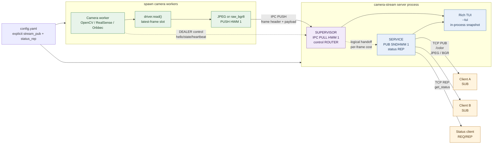

# camera-stream

Linux service for publishing multiple local cameras over ZeroMQ with a
latest-frame-wins policy. It supports OpenCV/V4L2, Intel RealSense, and Orbbec
color cameras.

## Run

Install the drivers used by `config.yaml`, then run the service:

```bash
uv sync --extra realsense --extra orbbec
uv run camera-stream --config config.yaml
```

The Python client demo needs only the server PUB endpoint. It discovers camera
names and image dimensions from frame headers, then displays every discovered
color stream in an OpenCV mosaic:

```bash
uv run python example/client.py --endpoint=tcp://127.0.0.1:5555
# Headless statistics-only mode
uv run python example/client.py --endpoint=tcp://127.0.0.1:5555 --no-display
```

For the three V4L2 devices available on this machine, use the ready-to-run
demo configuration. The client discovers all camera topics and shows them in a
single 2-column mosaic window:

```bash
uv run camera-stream --config config.demo.yaml --tui
uv run python example/client.py --endpoint=tcp://127.0.0.1:5555
```

Pass `--tui` to render a Rich dashboard in the same server process. The
dashboard reads supervisor state directly, so it does not create a second
status client or compete for either endpoint. Without `--tui`, the service
remains headless and suitable for systemd.

```bash
uv run camera-stream --config config.yaml --tui
```

## Architecture

The server is one `camera-stream` process with two logical data-plane stages:
the Supervisor aggregates frames from spawned camera workers, then the Service
publishes the live stream and exposes status. The TUI reads the same in-process
snapshot and does not create another ZeroMQ client.



### Data-flow guarantees

- Every frame path is bounded: the capture slot, IPC PUSH/PULL and PUB socket
  use capacity-one behavior, so old frames are dropped instead of queued.
- Camera workers use the `spawn` multiprocessing start method. A worker owns
  its camera SDK and reports `hello`, state transitions and heartbeat metrics
  through the internal ROUTER/DEALER control channel.
- `stream_pub` is a one-to-many ZeroMQ PUB endpoint. Clients subscribe to
  camera topics without competing for the stream. `status_rep` is a separate
  endpoint defined in `config.yaml`.
- The dashboard's `cost` values are processing costs: camera read, Supervisor
  PULL-to-PUB preparation and local PUB enqueue. Client receive/decode latency
  and actual client-side drops are not observable from PUB/SUB alone.

`stream_pub` publishes camera frames as three-part ZeroMQ messages:

```text
[topic UTF-8] [header JSON UTF-8] [JPEG or BGR bytes]
```

Topics are `<camera-name>/color`. The header declares `schema_version`,
`sequence`, capture timestamps, dimensions, pixel format and codec.

`status_rep` accepts `{"op":"get_status"}` and returns the supervisor's
current status snapshot. State changes are also published on the stream socket
under `status/<camera-name>`. A camera remains `STARTING` until its worker has
actually captured a first frame, then changes to `ONLINE`; this transition and
the first capture timestamp do not depend on any stream subscriber.

The service is intentionally live-only: no recording, replay, frame grouping,
or image transformation is performed. Every internal data stage has capacity
one, so a slow encoder or subscriber loses old frames instead of building a
queue.
