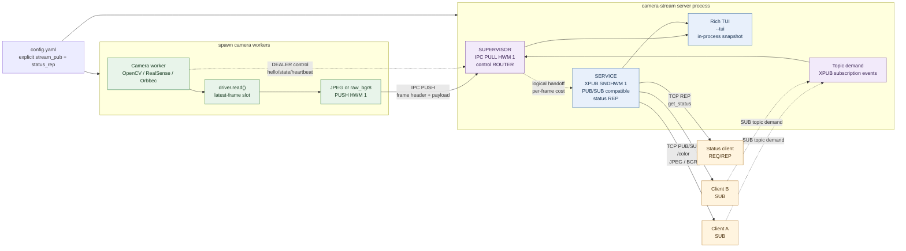

# camera-stream

> [!TIP]
> ## camera-stream | Project Card
>
> **camera-stream** is a lightweight Linux multi-camera streaming service. It
> broadcasts local camera images over ZeroMQ for trusted internal networks,
> designed for real-time-first machine-vision and robotics workloads where the
> newest frame is more valuable than retaining every frame.
>
> | Core capability | Design |
> | --- | --- |
> | Device support | V4L2/OpenCV cameras, Intel RealSense, and Orbbec cameras |
> | Low-latency broadcast | One-to-many ZeroMQ PUB/SUB with independently subscribable camera topics |
> | Real-time policy | Capacity-one, latest-frame-wins stages discard stale frames instead of accumulating latency |
> | Image format | Per-camera JPEG for lower bandwidth, or lossless `raw_bgr8` output |
> | On-demand operation | Topic-demand idle sleep/wake stops unused camera capture and encoding |
> | Operations | REP status API, stream status events, and an optional Rich monitoring dashboard |
>
> **Best suited to:** real-time robotic perception, multi-camera intranet
> distribution, and shared image sources for multiple algorithm nodes. It is a
> live-streaming service, not a recording or replay system.

Chinese documentation: [README.zh.md](README.zh.md)

Linux service for publishing multiple local cameras over ZeroMQ with a
latest-frame-wins policy.

## Run

### Run from PyPI

After the server package is published, start an OpenCV/V4L2-only deployment
without installing this repository:

`uvx` is the Python/uv equivalent of `npx`: it resolves the PyPI package into
an isolated cached environment and runs its command without a manual install.

```bash
uvx camera-stream-server --download-template
# Edit ./config.yaml for local devices and endpoints.
uvx camera-stream-server --config ./config.yaml
```

RealSense and Orbbec drivers are optional package extras. Select the extras
required by the cameras in the supplied configuration:

```bash
uvx --from 'camera-stream-server[realsense,orbbec]' \
  camera-stream-server --config /absolute/path/to/config.yaml
```

`--download-template` writes a starter OpenCV/V4L2 `config.yaml` into the
current directory and refuses to overwrite an existing file. The configuration
remains deployment-owned: adapt device paths, serial numbers, endpoints,
encoding, and idle policy before starting the service. The legacy
`camera-stream` command remains available in the installed package.

### Run from a checkout

Install the drivers used by `config.yaml`, then run the service:

```bash
uv sync --extra realsense --extra orbbec
uv run camera-stream --config config.yaml
```

The standalone visual debugging client needs only the server PUB endpoint. It
discovers camera names and image dimensions from frame headers, then displays
every discovered color stream in an OpenCV mosaic with live HUD metrics:

```bash
uv run --package camera-stream-client camera-stream-client \
  --endpoint=tcp://127.0.0.1:5555 \
  --status-endpoint=tcp://127.0.0.1:5556
```

For an isolated package run from this checkout, use
`uvx --no-cache --from ./example/camera-stream-client camera-stream-client ...`.
The `--no-cache` flag ensures that `uvx` rebuilds changed local source.

For the three V4L2 devices available on this machine, use the ready-to-run
demo configuration. The debugging client discovers all camera topics and
shows them in a single adaptive video wall:

```bash
uv run camera-stream --config config.demo.yaml --tui
uv run --package camera-stream-client camera-stream-client \
  --endpoint=tcp://127.0.0.1:5555 \
  --status-endpoint=tcp://127.0.0.1:5556
```

Pass `--tui` to render a Rich dashboard in the same server process. The
dashboard reads supervisor state directly, so it does not create a second
status client or compete for either endpoint. Without `--tui`, the service
remains headless and suitable for systemd.

```bash
uv run camera-stream --config config.yaml --tui
```

## systemd Deployment

Synchronize the environment with the camera drivers required by the selected
configuration, then install and start the system service:

```bash
uv sync --extra realsense --extra orbbec
sudo scripts/install_camera_stream_service.sh --config "$PWD/config.yaml"
```

The installer resolves absolute paths for `uv`, the project, and the YAML
configuration; installs `camera-stream.service`; and starts it without the
TUI. By default it runs as the user who invoked `sudo`, which must have read
access to the project/configuration and permission to access the cameras.

```bash
systemctl status camera-stream.service
journalctl -u camera-stream.service -f
```

Use `--user robot` to select a different runtime account, `--unit-name NAME`
for another unit name, and `--no-start` to install without starting it. Rerun
the installer after moving the checkout or changing the configuration path.

### Publish the server package

Build, validate, and dry-run a PyPI release:

```bash
scripts/publish_camera_stream_server.sh
```

Publish after setting a PyPI API token:

```bash
export UV_PUBLISH_TOKEN='pypi-...'
scripts/publish_camera_stream_server.sh --publish
```

Use `--testpypi --publish` with a TestPyPI token before the production upload.
The script rejects a dirty worktree unless `--allow-dirty` is explicitly set.

## Client Quick Start

The endpoints in `config.yaml` are server bind addresses. A remote client must
replace `0.0.0.0` with the server's reachable IP address. With the bundled
configuration, use `tcp://192.168.5.24:5555` for frames and
`tcp://192.168.5.24:5556` for status.

### Idle camera policy

`config.yaml` enables the following policy by default:

```yaml
idle_policy:
  enabled: true
  sleep_after_s: 60
```

The server exposes the same standard ZeroMQ PUB/SUB image protocol, but uses
an XPUB socket internally to observe SUB topic subscriptions. This is **topic
demand**, not TCP connection demand: a client that only queries `status_rep`
does not wake a camera.

After the last matching subscription to `<camera>/color` disappears, the
camera remains active for `sleep_after_s`. It then stops its worker, closes the
camera SDK, and stops capture and JPEG encoding. A matching subscription wakes
only that camera by spawning a fresh worker. A subscription to `b""` is a
prefix match for every camera topic and therefore wakes all cameras. No client
protocol change is required.

With this policy enabled, a camera normally progresses through
`IDLE_PENDING -> SLEEPING -> WAKING -> ONLINE`. The initial `STARTING` worker
also becomes `IDLE_PENDING` when no stream topic is subscribed. The first
frame after wake includes device open, exposure settling, and first-capture
time. Set `enabled: false` for continuous capture and the lowest first-frame
latency.

### Request camera status

The status endpoint uses a strict REQ/REP exchange. Send one request, receive
one snapshot, then send the next request on the same socket.

```python
import zmq

context = zmq.Context()
status = context.socket(zmq.REQ)
status.setsockopt(zmq.LINGER, 0)
status.connect("tcp://192.168.5.24:5556")

status.send_json({"op": "get_status"})
snapshot = status.recv_json()

for camera in snapshot["cameras"]:
    print(
        camera["name"],
        camera["state"],
        f"capture={camera['capture_fps']} fps",
        f"drops={camera['dropped_before_encode'] + camera['dropped_ipc']}",
    )

status.close()
context.term()
```

The snapshot includes service uptime, configured endpoints, current bitrate and
client metadata as well as the per-camera fields shown above. It is a point-in-
time query; request it again when a later state is needed.

### Subscribe to a camera stream

Each color stream is published under `<camera-name>/color`. The subscriber
below reads only `base_camera`; its high-water mark of one preserves the
latest-frame-wins policy on the client as well.

```python
import json

import zmq

context = zmq.Context()
stream = context.socket(zmq.SUB)
stream.setsockopt(zmq.RCVHWM, 1)
stream.setsockopt(zmq.LINGER, 0)
stream.setsockopt(zmq.SUBSCRIBE, b"base_camera/color")
stream.connect("tcp://192.168.5.24:5555")

try:
    while True:
        topic, header_bytes, payload = stream.recv_multipart()
        header = json.loads(header_bytes.decode("utf-8"))
        print(
            topic.decode("utf-8"),
            f"seq={header['sequence']}",
            f"{header['width']}x{header['height']}",
            f"codec={header['codec']}",
            f"payload={len(payload)} bytes",
        )
        # Decode JPEG with cv2.imdecode(...) when header["codec"] == "jpeg".
finally:
    stream.close()
    context.term()
```

To receive every camera topic, subscribe with `b""` instead. That also receives
two-part `status/<camera-name>` state events, so check the multipart length
before treating a message as a three-part image frame. See
[`example/camera-stream-client/`](example/camera-stream-client/) for the
installable visual debugging client. It can be run locally with the `uvx`
command above, then from PyPI as `uvx camera-stream-client ...` after release.

## Architecture

The server is one `camera-stream` process with two logical data-plane stages:
the Supervisor aggregates frames from spawned camera workers, then the Service
publishes the live stream and exposes status. The TUI reads the same in-process
snapshot and does not create another ZeroMQ client.



### Data-flow guarantees

- Every frame path is bounded: the capture slot, IPC PUSH/PULL and XPUB socket
  use capacity-one behavior, so old frames are dropped instead of queued.
- Camera workers use the `spawn` multiprocessing start method. A worker owns
  its camera SDK and reports `hello`, state transitions and heartbeat metrics
  through the internal ROUTER/DEALER control channel.
- `stream_pub` is externally a standard one-to-many ZeroMQ PUB/SUB endpoint.
  Internally it is XPUB solely to observe subscription events for idle policy;
  clients use ordinary SUB sockets and do not compete for frames. `status_rep`
  is a separate endpoint defined in `config.yaml`.
- The dashboard's `cost` values are processing costs: camera read, Supervisor
  PULL-to-PUB preparation and local PUB enqueue. Client receive/decode latency
  and actual client-side drops are not observable from PUB/SUB alone.

## TUI Dashboard

Run `camera-stream --config config.yaml --tui` to render the following
in-process topology view. Nodes are vertically centered against their adjacent
node stacks; each arrow is shown as protocol, direction and transport labels.

```mermaid
flowchart LR
    subgraph Screen["CAMERA STREAM                                      uptime HH:MM:SS"]
        direction LR

        subgraph Cameras["Camera nodes (one panel per configured camera)"]
            direction TB
            Cam1["front_camera [ONLINE]<br/>opencv 1920x1080 @30<br/>capture 30 fps<br/>to pub 4 ms<br/>ipc 0.62 ms<br/>drops slot 2 ipc 0<br/>subtitle: cost 3 ms"]
            Cam2["side_camera [SLEEPING]<br/>realsense 1280x720 @30<br/>capture 0 fps<br/>to pub -<br/>ipc -<br/>drops slot 0 ipc 0<br/>no subscribed stream topic<br/>subtitle: cost -"]
        end

        Ipc["IPC<br/>>>>>>>><br/>PUSH / PULL"]

        Supervisor["SUPERVISOR<br/>frame PULL, HWM 1<br/>control ROUTER<br/>workers N<br/>subtitle: cost N ms"]

        Zmq["ZeroMQ<br/>>>>>>>><br/>XPUB / REP"]

        Service["SERVICE<br/>XPUB tcp://host:5555<br/>REP tcp://host:5556<br/>rate N Mbps<br/>egress N Mbps<br/>clients N<br/>subtitle: cost N ms"]

        Pub["PUB<br/>>>>>>>><br/>SUB"]

        subgraph Clients["Connected clients (dynamic, vertical)"]
            direction TB
            Client1["192.168.5.21<br/>codec JPEG<br/>est rx N Mbps<br/>peer 54321/TCP<br/>subtitle: up HH:MM:SS"]
            Client2["192.168.5.22<br/>codec JPEG<br/>est rx N Mbps<br/>peer 54322/TCP<br/>subtitle: up HH:MM:SS"]
        end

        Cameras --> Ipc --> Supervisor --> Zmq --> Service --> Pub --> Clients
    end

    classDef camera fill:#e8f4ea,stroke:#2f7d45,color:#173b21
    classDef offline fill:#fce8e6,stroke:#b44b3e,color:#5a1e18
    classDef supervisor fill:#f2eafa,stroke:#7b4aa5,color:#321b4d
    classDef service fill:#e8f0fb,stroke:#3d6ea8,color:#1c3554
    classDef client fill:#fff4df,stroke:#b47720,color:#4c3210
    class Cam1 camera
    class Cam2 offline
    class Supervisor supervisor
    class Service service
    class Client1,Client2 client
```



### Panel fields

- **Camera**: state, driver/profile, capture FPS, end-to-end capture-to-PUB
  latency, IPC encode/send cost and drop counters. With idle policy enabled,
  `IDLE_PENDING`, `SLEEPING`, and `WAKING` show demand-driven lifecycle state.
  Its subtitle is the measured `driver.read()` cost.
- **SUPERVISOR**: IPC PULL and control ROUTER roles plus worker count. Its
  `active/total` worker count reveals cameras currently kept awake. Its
  subtitle is time from complete IPC receipt to beginning PUB forwarding.
- **SERVICE**: the configured XPUB (PUB/SUB-compatible) and REP endpoints,
  current publish rate,
  estimated egress (`rate × connected clients`) and client count. Its subtitle
  is the local PUB enqueue cost.
- **Client**: remote IP and TCP port, available codecs, estimated receive rate
  and connection uptime. PUB/SUB cannot expose the client's actual
  subscriptions, receive rate, drops or decode latency without an additional
  client telemetry channel.

`stream_pub` publishes camera frames as three-part ZeroMQ messages:

```text
[topic UTF-8] [header JSON UTF-8] [JPEG or BGR bytes]
```

Topics are `<camera-name>/color`. The header declares `schema_version`,
`sequence`, capture timestamps, dimensions, pixel format and codec.

### Frame header reference

The second ZeroMQ message part is UTF-8 JSON. For example:

```json
{
  "camera": "base_camera",
  "captured_monotonic_ns": 77378702275284,
  "captured_utc_ns": 1787108850771291701,
  "codec": "jpeg",
  "height": 480,
  "payload_size": 56182,
  "pixel_format": "bgr8",
  "schema_version": 1,
  "sequence": 44005,
  "stream": "color",
  "timestamp_source": "host",
  "width": 640
}
```

| Field | Example | Meaning and client use |
| --- | --- | --- |
| `schema_version` | `1` | Header contract version. Reject or explicitly handle unknown versions before decoding a frame. |
| `camera` | `base_camera` | Configured camera name. Together with `stream`, it determines the topic `base_camera/color`. |
| `stream` | `color` | Stream kind. The current service publishes only the BGR color stream. |
| `sequence` | `44005` | Per-worker frame counter, beginning at `1` when a worker starts. A jump indicates skipped frames; it is not globally ordered and resets after a worker restart. |
| `captured_monotonic_ns` | `77378702275284` | Host monotonic-clock timestamp at capture, in nanoseconds. Use only for elapsed-time calculations on the same server host; it has no UTC epoch and cannot be compared across hosts or persisted as wall-clock time. |
| `captured_utc_ns` | `1787108850771291701` | Host wall-clock UTC timestamp at capture, in nanoseconds since Unix epoch. This sample is `2026-08-19T03:07:30.771291701Z`. It is suitable for logging and cross-machine correlation, subject to host clock synchronization. |
| `timestamp_source` | `host` | Both timestamps are produced by the server host after `driver.read()` returns, not by a camera hardware clock. |
| `width` / `height` | `640` / `480` | Image dimensions in pixels. For `raw_bgr8`, expected payload length is `width * height * 3`. |
| `pixel_format` | `bgr8` | Pixel layout of the decoded image: 8-bit blue, green, red channels. JPEG payloads should decode to this layout with OpenCV. |
| `codec` | `jpeg` | Payload encoding. `jpeg` requires image decoding; `raw_bgr8` is a directly reshaped BGR buffer. |
| `payload_size` | `56182` | Byte count of the third ZeroMQ message part. Verify `len(payload) == payload_size` before decoding; it is `56,182` bytes in this sample. |

For a `jpeg` frame, decode the third part with
`cv2.imdecode(np.frombuffer(payload, dtype=np.uint8), cv2.IMREAD_COLOR)`. For
`raw_bgr8`, first verify `payload_size == width * height * 3`, then reshape it
to `(height, width, 3)` with `np.uint8`.

`status_rep` accepts `{"op":"get_status"}` and returns the supervisor's
current status snapshot. Each camera includes `demand_subscriptions` (matching
SUB subscription count, not connected-client count) and `idle_after_s`; the
service includes `active_worker_count` and its effective `idle_policy`. State
changes are also published on the stream socket under
`status/<camera-name>`. When idle policy is disabled, a camera remains
`STARTING` until its worker captures a first frame, then changes to `ONLINE`
without any stream subscriber. When it is enabled, only a matching stream
subscription keeps that camera awake or wakes it from `SLEEPING`.

The service is intentionally live-only: no recording, replay, frame grouping,
or image transformation is performed. Every internal data stage has capacity
one, so a slow encoder or subscriber loses old frames instead of building a
queue.
