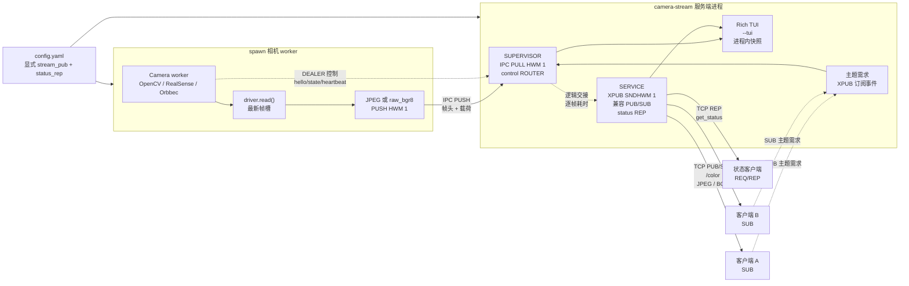
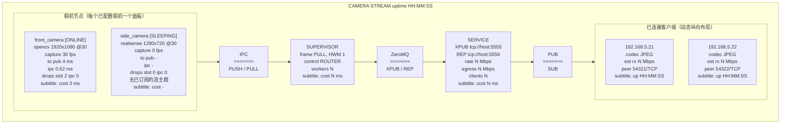

# camera-stream

[English](README.md)

> [!TIP]
> ## camera-stream | 极简项目卡片
>
> **camera-stream** 是一款运行于 Linux 的轻量化多路相机推流服务。它基于
> ZeroMQ 在可信内网中广播本地相机画面，面向实时优先的机器视觉与机器人工作负载：
> 当前帧的价值高于保留每一帧。
>
> | 核心能力 | 设计 |
> | --- | --- |
> | 设备支持 | V4L2/OpenCV 通用相机、Intel RealSense 与 Orbbec 相机 |
> | 低延迟广播 | 一对多 ZeroMQ PUB/SUB，每台相机拥有可独立订阅的主题 |
> | 实时策略 | 全链路容量为一、弃旧留新，不让陈旧帧堆积为延迟 |
> | 图像格式 | 每台相机可选低带宽 JPEG，或无损 `raw_bgr8` 原始输出 |
> | 按需运行 | 根据主题订阅需求让空闲相机休眠/唤醒，停止不需要的采集和编码 |
> | 运维能力 | 独立 REP 状态接口、状态事件流，以及可选 Rich 监控仪表盘 |
>
> **适用场景：** 机器人实时视觉感知、内网多路相机分发、多算法节点共享图像源。
> 本项目提供实时画面，不提供录制或回放。

面向多路本地相机的 Linux ZeroMQ 推流服务，采用“最新帧优先”策略，支持
OpenCV/V4L2、Intel RealSense 和 Orbbec 彩色相机。

## 运行

安装 `config.yaml` 中所用相机的驱动依赖后启动服务：

```bash
uv sync --extra realsense --extra orbbec
uv run camera-stream --config config.yaml
```

独立的图形调试客户端只需连接服务端的 PUB 端点。它会从帧头自动发现相机名称和
分辨率，并以 OpenCV 拼墙显示所有已发现的彩色流及实时 HUD 指标：

```bash
uv run --package camera-stream-client camera-stream-client \
  --endpoint=tcp://127.0.0.1:5555 \
  --status-endpoint=tcp://127.0.0.1:5556
```

若要从当前检出目录以隔离环境运行该客户端，请使用：
`uvx --no-cache --from ./example/camera-stream-client camera-stream-client ...`。
`--no-cache` 会确保 `uvx` 重新构建已变更的本地源码。

本机若有三台可用的 V4L2 设备，可使用开箱即用的示例配置。调试客户端会发现所有
相机主题，并以自适应视频墙显示：

```bash
uv run camera-stream --config config.demo.yaml --tui
uv run --package camera-stream-client camera-stream-client \
  --endpoint=tcp://127.0.0.1:5555 \
  --status-endpoint=tcp://127.0.0.1:5556
```

传入 `--tui` 会在同一个服务端进程中显示 Rich 仪表盘。它直接读取 Supervisor 的
进程内状态，不会创建第二个状态客户端，也不会与任何端点竞争。未传入 `--tui` 时，
服务保持无界面模式，适合通过 systemd 部署。

```bash
uv run camera-stream --config config.yaml --tui
```

## 客户端快速开始

`config.yaml` 中的端点是服务端的绑定地址。远端客户端必须将 `0.0.0.0` 替换为
服务端的可达 IP。使用随附配置时，帧流端点为
`tcp://192.168.5.24:5555`，状态端点为 `tcp://192.168.5.24:5556`。

### 空闲相机策略

`config.yaml` 默认启用以下策略：

```yaml
idle_policy:
  enabled: true
  sleep_after_s: 60
```

服务端对外仍是标准的 ZeroMQ PUB/SUB 图像协议，但内部使用 XPUB socket 观察 SUB
主题订阅。这里依据的是**主题需求**，而不是 TCP 连接需求：仅查询 `status_rep` 的
客户端不会唤醒相机。

最后一个与 `<camera>/color` 匹配的订阅取消后，相机会继续工作 `sleep_after_s` 秒。
随后服务端停止该相机 worker、关闭相机 SDK，并停止采集和 JPEG 编码。新的匹配订阅
只会通过新建 worker 唤醒对应相机。订阅 `b""` 是所有相机主题的前缀匹配，因此会
唤醒全部相机。客户端协议无需任何改动。

启用策略时，空闲相机通常经历以下状态：
`IDLE_PENDING -> SLEEPING -> WAKING -> ONLINE`。没有任何流主题订阅时，最初的
`STARTING` worker 也会变为 `IDLE_PENDING`。唤醒后的首帧时间包括设备打开、曝光
稳定和首次采集。将 `enabled` 设为 `false` 可保持持续采集，获得最低的首帧延迟。

### 查询相机状态

状态端点采用严格的 REQ/REP 往返：发送一个请求，接收一个快照，再使用同一 socket
发送下一个请求。

```python
import zmq

context = zmq.Context()
status = context.socket(zmq.REQ)
status.setsockopt(zmq.LINGER, 0)
status.connect("tcp://192.168.5.24:5556")

status.send_json({"op": "get_status"})
snapshot = status.recv_json()

for camera in snapshot["cameras"]:
    print(
        camera["name"],
        camera["state"],
        f"capture={camera['capture_fps']} fps",
        f"drops={camera['dropped_before_encode'] + camera['dropped_ipc']}",
    )

status.close()
context.term()
```

快照包含服务运行时长、已配置端点、当前码率、客户端元数据，以及上例中的单相机字段。
它是一个时间点快照；需要新状态时请再次请求。

### 订阅相机流

每个彩色流发布在 `<camera-name>/color` 主题下。下面的订阅者只读取 `base_camera`；
高水位线设为一，因此客户端也保持最新帧优先策略。

```python
import json

import zmq

context = zmq.Context()
stream = context.socket(zmq.SUB)
stream.setsockopt(zmq.RCVHWM, 1)
stream.setsockopt(zmq.LINGER, 0)
stream.setsockopt(zmq.SUBSCRIBE, b"base_camera/color")
stream.connect("tcp://192.168.5.24:5555")

try:
    while True:
        topic, header_bytes, payload = stream.recv_multipart()
        header = json.loads(header_bytes.decode("utf-8"))
        print(
            topic.decode("utf-8"),
            f"seq={header['sequence']}",
            f"{header['width']}x{header['height']}",
            f"codec={header['codec']}",
            f"payload={len(payload)} bytes",
        )
        # 当 header["codec"] == "jpeg" 时使用 cv2.imdecode(...) 解码。
finally:
    stream.close()
    context.term()
```

若需订阅所有相机主题，请订阅 `b""`。这也会收到两段式的
`status/<camera-name>` 状态事件，因此在将消息视作三段式图像帧前，需要检查消息段数。
可安装的图形调试客户端见 [`example/camera-stream-client/`](example/camera-stream-client/)。
它可以使用上面的本地 `uv` 命令运行；发布到 PyPI 后可通过
`uvx camera-stream-client ...` 运行。

## 架构

服务端是单个 `camera-stream` 进程，包含两个逻辑数据平面阶段：Supervisor 聚合由
`spawn` 启动的相机 worker 的帧，随后 Service 发布实时流并提供状态。TUI 读取同一个
进程内快照，不会新建 ZeroMQ 客户端。



### 数据流保证

- 每个帧路径均有上界：采集槽、IPC PUSH/PULL 与 XPUB socket 都采用容量为一的行为，
  因此会丢弃旧帧而不会排队。
- 相机 worker 使用 `spawn` 多进程启动方式。worker 独占其相机 SDK，并通过内部
  ROUTER/DEALER 控制通道上报 `hello`、状态变更和心跳指标。
- `stream_pub` 对外是标准的一对多 ZeroMQ PUB/SUB 端点。内部的 XPUB 仅用于观察空闲
  策略所需的订阅事件；客户端使用普通 SUB socket，彼此不会竞争帧。`status_rep` 是在
  `config.yaml` 中单独定义的端点。
- 仪表盘的 `cost` 均为处理耗时：相机读取、Supervisor 从 PULL 收到帧到准备 PUB 转发、
  以及本地 PUB 入队。仅靠 PUB/SUB 无法观测客户端接收/解码延迟或实际客户端丢帧。

## TUI 仪表盘

运行 `camera-stream --config config.yaml --tui` 可以显示进程内拓扑视图。节点相对于相邻
节点栈垂直居中；每个箭头依次标记协议、方向和传输形式。



### 面板字段

- **Camera**：状态、驱动/配置、采集 FPS、从采集到 PUB 的端到端延迟、IPC 编码/发送
  耗时及丢帧计数。启用空闲策略后，`IDLE_PENDING`、`SLEEPING` 和 `WAKING` 表示按
  订阅需求变化的生命周期状态。副标题为测得的 `driver.read()` 耗时。
- **SUPERVISOR**：IPC PULL 和控制 ROUTER 角色，以及 worker 数量。`active/total`
  表示当前保持唤醒的相机数/相机总数。副标题是从完整 IPC 接收至开始 PUB 转发的时间。
- **SERVICE**：配置的 XPUB（兼容 PUB/SUB）与 REP 端点、当前发布速率、估算出口流量
  （`rate × connected clients`）及客户端数量。副标题为本地 PUB 入队耗时。
- **Client**：远端 IP 和 TCP 端口、可用编解码格式、估算接收速率与连接时长。没有额外的
  客户端遥测通道时，PUB/SUB 无法暴露客户端实际订阅、接收速率、丢帧或解码延迟。

`stream_pub` 以三段式 ZeroMQ 消息发布相机帧：

```text
[topic UTF-8] [header JSON UTF-8] [JPEG or BGR bytes]
```

主题为 `<camera-name>/color`。帧头声明 `schema_version`、`sequence`、采集时间戳、
图像尺寸、像素格式和编码格式。

### 帧头参考

第二个 ZeroMQ 消息段是 UTF-8 JSON。例如：

```json
{
  "camera": "base_camera",
  "captured_monotonic_ns": 77378702275284,
  "captured_utc_ns": 1787108850771291701,
  "codec": "jpeg",
  "height": 480,
  "payload_size": 56182,
  "pixel_format": "bgr8",
  "schema_version": 1,
  "sequence": 44005,
  "stream": "color",
  "timestamp_source": "host",
  "width": 640
}
```

| 字段 | 示例 | 含义和客户端用法 |
| --- | --- | --- |
| `schema_version` | `1` | 帧头契约版本。解码前应拒绝或显式处理未知版本。 |
| `camera` | `base_camera` | 配置的相机名称；与 `stream` 一同决定主题 `base_camera/color`。 |
| `stream` | `color` | 流类型。当前服务仅发布 BGR 彩色流。 |
| `sequence` | `44005` | 每个 worker 的帧序号，worker 启动后从 `1` 开始。跳变表示帧被跳过；它不保证全局有序，worker 重启后会重置。 |
| `captured_monotonic_ns` | `77378702275284` | 服务端主机的单调时钟采集时间戳，单位纳秒。仅用于同一主机上的耗时计算；没有 UTC 纪元，不能跨主机比较或作为持久化墙钟时间。 |
| `captured_utc_ns` | `1787108850771291701` | 服务端主机的 UTC 墙钟采集时间戳，单位为 Unix epoch 起的纳秒。示例对应 `2026-08-19T03:07:30.771291701Z`。适合日志和跨机器关联，但依赖主机时钟同步。 |
| `timestamp_source` | `host` | 两个时间戳均由服务端主机在 `driver.read()` 返回后生成，不是相机硬件时钟。 |
| `width` / `height` | `640` / `480` | 图像像素尺寸。`raw_bgr8` 的预期载荷长度是 `width * height * 3`。 |
| `pixel_format` | `bgr8` | 解码后图像的像素布局：每通道 8 位的蓝、绿、红。JPEG 载荷应由 OpenCV 解码为该布局。 |
| `codec` | `jpeg` | 载荷编码。`jpeg` 需要图像解码；`raw_bgr8` 是可直接 reshape 的 BGR 缓冲区。 |
| `payload_size` | `56182` | 第三段 ZeroMQ 消息的字节数。解码前验证 `len(payload) == payload_size`；本例为 `56,182` 字节。 |

对 `jpeg` 帧，使用
`cv2.imdecode(np.frombuffer(payload, dtype=np.uint8), cv2.IMREAD_COLOR)` 解码
第三段。对 `raw_bgr8`，先验证 `payload_size == width * height * 3`，再用
`np.uint8` reshape 为 `(height, width, 3)`。

`status_rep` 接受 `{"op":"get_status"}` 并返回 Supervisor 的当前状态快照。每台
相机含有 `demand_subscriptions`（匹配的 SUB 订阅数，而非已连接客户端数）和
`idle_after_s`；服务含有 `active_worker_count` 和生效的 `idle_policy`。状态变更也会在
流 socket 上以 `status/<camera-name>` 主题发布。关闭空闲策略时，相机会一直处于
`STARTING`，直至 worker 实际采集到首帧后变为 `ONLINE`，不依赖任何流订阅者。启用策略
时，只有匹配的流订阅才能让该相机保持唤醒，或从 `SLEEPING` 状态唤醒它。

服务有意仅提供实时数据：不执行录制、回放、帧分组或图像变换。所有内部数据阶段容量
均为一，因此慢速编码器或订阅者会失去旧帧，而不会形成队列。
