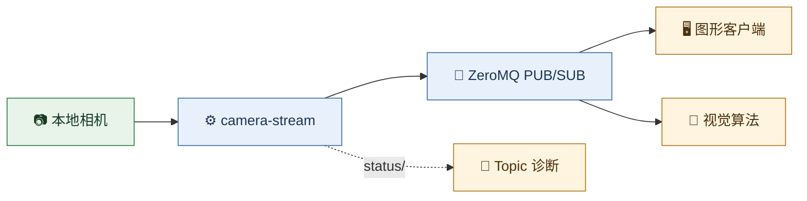
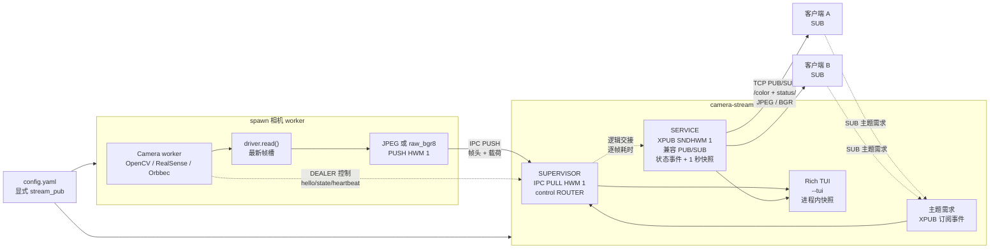
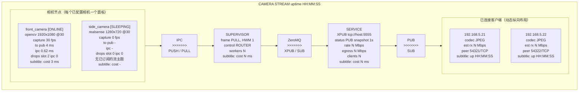

# camera-stream

<p align="center">
  
  
  
  
</p>

<p align="center"><strong>面向可信 Linux 内网的低延迟多路相机画面广播服务。</strong></p>

**文档：** [English](README.md) · [简体中文](README.zh.md)

> [!TIP]
> ## 📹 camera-stream | 极简项目卡片
>
> **camera-stream** 是一款运行于 Linux 的轻量化多路相机推流服务。它基于
> ZeroMQ 在可信内网中广播本地相机画面，面向实时优先的机器视觉与机器人工作负载：
> 当前帧的价值高于保留每一帧。
>
> | 核心能力 | 设计 |
> | --- | --- |
> | 📷 设备支持 | V4L2/OpenCV 通用相机、Intel RealSense 与 Orbbec 相机 |
> | 📡 低延迟广播 | 一对多 ZeroMQ PUB/SUB，每台相机拥有可独立订阅的主题 |
> | ⚡ 实时策略 | 全链路容量为一、弃旧留新，不让陈旧帧堆积为延迟 |
> | 🖼️ 图像格式 | 每台相机可选低带宽 JPEG，或无损 `raw_bgr8` 原始输出 |
> | 💤 按需运行 | 根据主题订阅需求让空闲相机休眠/唤醒，停止不需要的采集和编码 |
> | 📊 运维能力 | 同一推流端点上的状态事件与周期快照，以及可选 Rich 监控仪表盘 |
>
> **🎯 适用场景：** 机器人实时视觉感知、内网多路相机分发、多算法节点共享图像源。
> 本项目提供实时画面，不提供录制或回放。



| 从这里开始 | 命令 | 你将得到 |
| --- | --- | --- |
| 🖥️ 发布相机 | `uvx camera-stream server --config ./config.yaml` | 服务端与可选 Rich TUI |
| 👀 查看实时画面 | `uvx camera-stream client --endpoint tcp://HOST:5555` | 多相机图形监控工具 |
| 🔎 诊断流 | `uvx camera-stream topic list --endpoint tcp://HOST:5555` | topic、状态、帧率和带宽信息 |
| 🧩 Python 接入 | `from camera_stream import StreamClient` | 解码后的最新帧客户端 API |

## 🚀 快速开始

`uvx` 是 Python/uv 中对应 `npx` 的一次性运行方式：它在隔离且可缓存的环境中解析
PyPI 包并执行命令，无需手动安装。

### 1. 📡 使用 `uvx` 运行服务端

无需克隆仓库，即可启动仅使用 OpenCV/V4L2 的部署：

```bash
uvx camera-stream server --download-template
# 修改当前目录下的 ./config.yaml，填入本机设备与端点。
uvx camera-stream server --config ./config.yaml
```

RealSense 与 Orbbec 驱动是可选包 extra。根据配置中的相机选择所需 extra：

```bash
uvx --from 'camera-stream[realsense,orbbec]' \
  camera-stream server --config /absolute/path/to/config.yaml
```

`--download-template` 会在当前目录写入 OpenCV/V4L2 起步配置 `config.yaml`，若目标文件
已经存在则拒绝覆盖。启动前请修改本机设备路径、序列号、端点、编码和空闲策略。

### 2. 👀 使用 `uvx` 查看全部相机

图形客户端会自动发现已配置的相机，并显示全部彩色流及实时诊断信息：

```bash
uvx camera-stream client --endpoint tcp://192.168.5.24:5555
```

使用服务端实际可达的 IP，而不是绑定地址 `0.0.0.0`。

### 3. 🔎 使用 `uvx` 诊断 topic

统一包提供类似 ROS 的只读诊断命令。无需检出仓库，只连接公共推流端点：

```bash
uvx camera-stream topic list --endpoint tcp://192.168.5.24:5555
uvx camera-stream topic list --endpoint tcp://192.168.5.24:5555 --verbose
uvx camera-stream topic info base_camera/color --endpoint tcp://192.168.5.24:5555
uvx camera-stream topic echo base_camera/color --endpoint tcp://192.168.5.24:5555 --count 1
uvx camera-stream topic hz base_camera/color --endpoint tcp://192.168.5.24:5555
uvx camera-stream topic bw base_camera/color --endpoint tcp://192.168.5.24:5555
```

`list` 读取状态目录并列出全部已配置的 `<camera>/color` 主题，不会唤醒相机。`info` 输出
最近状态与真实帧头；`echo`、`hz` 和 `bw` 订阅选定图像主题，因此在空闲策略下会唤醒对应
相机。`hz` 统计收到的帧率，`bw` 统计编码图像载荷的 Mbps。传入 `--count N` 可限制诊断
帧数；`hz` 和 `bw` 还支持 `--window SECONDS`。

## 🧩 自定义客户端接入

`config.yaml` 中的端点是服务端绑定地址。远端客户端必须将 `0.0.0.0` 替换为服务端可达
IP。使用随附配置时，图像和状态均使用 `tcp://192.168.5.24:5555`。

### 🐍 使用客户端包

应用若需要已解码图像，又不希望自行管理 ZeroMQ socket，可使用
`camera-stream` 提供的最新帧优先接口：

```python
from camera_stream import StreamClient

with StreamClient("tcp://192.168.5.24:5555") as client:
    # subscribe() 默认等待第一张已解码画面。
    camera = client.subscribe("base_camera/color")
    camera.wait_for_state("ONLINE", timeout=5)
    while True:
        frame = camera.read(timeout=1)
        image = frame.image  # NumPy BGR 图像
        print(frame.sequence, frame.age_ms, camera.metrics["average_fps"])
```

`read()` 返回最新未读帧，并丢弃未读取的旧帧。`read(block=False)` 为非阻塞快照读取，行为
等同于 `latest()`，只会在首帧到达前返回 `None`；`read(timeout=N)` 最多等待 `N` 秒，超时
抛出 `TimeoutError`。`latest()` 和 `last_frame` 查看最近一次接收的帧且不消费它，因此会
持续返回该帧，直到新帧到达。`state`、
`error`、`status`、`metrics` 和 `wait_for_state()` 则提供服务端状态和本地接收诊断。

`subscribe()` 默认预热新流：只有收到有效首帧后才返回，因此可立即调用
`read(block=False)`。传入 `warm_up_timeout=N` 可限制等待时间；传入 `warm_up=False`
则在首帧到达前立即返回。`camera.warm_up(timeout=N)` 可为已有订阅执行同样等待。

### 📬 发现相机 topic 与状态

使用随附 CLI 发现 topic 和诊断状态。CLI 会处理底层协议与最新帧策略，因此业务代码无需
自行管理 ZeroMQ socket 或解析状态消息。

| 需求 | 推荐命令 | 是否唤醒相机 |
| --- | --- | --- |
| 列出可用相机 topic | `camera-stream topic list --endpoint tcp://HOST:5555` | 否 |
| 列出 topic 与生命周期状态 | `camera-stream topic list --verbose --endpoint tcp://HOST:5555` | 否 |
| 查看单流状态和帧头 | `camera-stream topic info base_camera/color --endpoint tcp://HOST:5555` | 是，临时唤醒 |
| 查看帧头或测量 FPS / Mbps | `topic echo`、`topic hz`、`topic bw` | 是，命令运行期间 |

`list` 与 `list --verbose` 仅读取周期状态快照，不会产生相机需求。`info`、`echo`、`hz` 和
`bw` 会订阅图像 topic，因此在启用空闲策略时会唤醒对应相机。

### 🖼️ 订阅相机流

应用中应使用 `StreamClient`。它会解码 JPEG 或 `raw_bgr8`，只保留最新帧，并在后台更新
状态。上方的完整示例即为推荐接入方式。

| 需求 | `CameraStream` API |
| --- | --- |
| 等待一张新帧 | `camera.read(timeout=1)` |
| 查看保留的最新帧 | `camera.read(block=False)` |
| 观察生命周期 / 错误 | `camera.state`、`camera.error`、`camera.status` |
| 查看本地接收和丢帧指标 | `camera.metrics` |
| 停止一个图像 topic | `camera.unsubscribe()` |

使用 `camera-stream client` 命令可交互式查看所有已配置相机。下方的原生 ZeroMQ 多段消息布局仅作为高级
互操作实现的协议参考，不是常规接入方式。

### 💤 空闲相机策略

`config.yaml` 默认启用以下策略：

```yaml
idle_policy:
  enabled: true
  sleep_after_s: 60
```

服务端内部通过 XPUB socket 观察 SUB 的主题订阅。它依据的是**主题需求**，不是 TCP
连接需求：仅订阅 `status/` 的客户端不会唤醒相机。

最后一个与 `<camera>/color` 匹配的订阅消失后，相机会继续工作 `sleep_after_s` 秒，随后
停止 worker、关闭相机 SDK，并停止采集和编码。新的匹配订阅只会唤醒对应相机。订阅 `b""`
是所有主题的前缀匹配，因此会唤醒全部相机。

只有需求持续缺失直至 worker 停止时，相机才会经历
`IDLE_PENDING -> SLEEPING -> WAKING -> ONLINE`。若在 `IDLE_PENDING` 期间需求恢复，
仍存活的 worker 会直接恢复到此前状态，通常为 `ONLINE`，不重新打开相机。将 `enabled`
设为 `false` 可保持持续采集，获得最低的首帧延迟。

## 🛠️ 从检出目录运行

安装 `config.yaml` 中所用相机的驱动依赖后启动服务：

```bash
uv sync --extra realsense --extra orbbec
uv run camera-stream server --config config.yaml
```

从工作区运行本地客户端：

```bash
uv run camera-stream client \
  --endpoint=tcp://127.0.0.1:5555
```

`uv run camera-stream client` 使用当前检出目录的源码。

本机若有三台可用的 V4L2 设备，可使用示例配置开发和查看服务端 TUI：

```bash
uv run camera-stream server --config config.demo.yaml --tui
```

`--tui` 在同一个服务端进程中显示 Rich 仪表盘。它直接读取进程内状态，不创建 ZeroMQ
客户端。未传入该参数时，服务保持无界面模式，适合 systemd 部署。

## ⚙️ systemd 部署

先按所选配置同步相机驱动依赖，再安装并启动系统服务：

```bash
uv sync --extra realsense --extra orbbec
sudo scripts/install_camera_stream_service.sh --config "$PWD/config.yaml"
```

安装脚本会解析 `uv`、项目目录和 YAML 配置的绝对路径，安装
`camera-stream.service`，并在不启用 TUI 的情况下启动它。默认以执行 `sudo` 的用户运行；
该用户必须具有访问相机的权限。

```bash
systemctl status camera-stream.service
journalctl -u camera-stream.service -f
```

可通过 `--user robot` 指定其他运行账户，使用 `--unit-name NAME` 指定其他单元名称，
使用 `--no-start` 只安装而不启动。移动检出目录或修改配置路径后，应重新运行安装脚本。

## 📦 发布统一包

```bash
scripts/publish_camera_stream.sh

export UV_PUBLISH_TOKEN='pypi-...'
scripts/publish_camera_stream.sh --publish
```

正式发布前可用 TestPyPI token 执行 `--testpypi --publish`。除非显式传入
`--allow-dirty`，脚本会拒绝在脏工作区中发布。

## 🏗️ 架构

服务端是单个 `camera-stream` 进程，包含两个逻辑数据平面阶段：Supervisor 聚合由
`spawn` 启动的相机 worker 的帧，随后 Service 发布实时流并提供状态。TUI 读取同一个
进程内快照，不会新建 ZeroMQ 客户端。



### ⚡ 数据流保证

- 每个帧路径均有上界：采集槽、IPC PUSH/PULL 与 XPUB socket 都采用容量为一的行为，
  因此会丢弃旧帧而不会排队。
- 相机 worker 使用 `spawn` 多进程启动方式。worker 独占其相机 SDK，并通过内部
  ROUTER/DEALER 控制通道上报 `hello`、状态变更和心跳指标。
- `stream_pub` 是唯一的对外一对多 ZeroMQ PUB/SUB 端点。内部的 XPUB 仅用于观察空闲
  策略所需的订阅事件；客户端使用普通 SUB socket，彼此不会竞争帧。它立即发布
  `status/camera/<camera-name>` 状态事件，并每秒及新的快照订阅生效时发布完整的
  `status/snapshot`。状态消息与帧一样为尽力而为；仅订阅状态不会产生相机需求。
- 仪表盘的 `cost` 均为处理耗时：相机读取、Supervisor 从 PULL 收到帧到准备 PUB 转发、
  以及本地 PUB 入队。仅靠 PUB/SUB 无法观测客户端接收/解码延迟或实际客户端丢帧。

## 📊 TUI 仪表盘

运行 `camera-stream server --config config.yaml --tui` 可以显示进程内拓扑视图。节点相对于相邻
节点栈垂直居中；每个箭头依次标记协议、方向和传输形式。



### 🧾 面板字段

- **Camera**：状态、驱动/配置、采集 FPS、从采集到 PUB 的端到端延迟、IPC 编码/发送
  耗时及丢帧计数。启用空闲策略后，`IDLE_PENDING`、`SLEEPING` 和 `WAKING` 表示按
  订阅需求变化的生命周期状态。副标题为测得的 `driver.read()` 耗时。
- **SUPERVISOR**：IPC PULL 和控制 ROUTER 角色，以及 worker 数量。`active/total`
  表示当前保持唤醒的相机数/相机总数。副标题是从完整 IPC 接收至开始 PUB 转发的时间。
- **SERVICE**：配置的 XPUB（兼容 PUB/SUB）端点、周期状态快照频率、当前发布速率、估算
  出口流量（`rate × connected clients`）及客户端数量。副标题为本地 PUB 入队耗时。
- **Client**：远端 IP 和 TCP 端口、可用编解码格式、估算接收速率与连接时长。没有额外的
  客户端遥测通道时，PUB/SUB 无法暴露客户端实际订阅、接收速率、丢帧或解码延迟。

`stream_pub` 以三段式 ZeroMQ 消息发布相机帧：

```text
[topic UTF-8] [header JSON UTF-8] [JPEG or BGR bytes]
```

主题为 `<camera-name>/color`。帧头声明 `schema_version`、`sequence`、采集时间戳、
图像尺寸、像素格式和编码格式。

### 🧬 帧头参考

第二个 ZeroMQ 消息段是 UTF-8 JSON。例如：

```json
{
  "camera": "base_camera",
  "captured_monotonic_ns": 77378702275284,
  "captured_utc_ns": 1787108850771291701,
  "codec": "jpeg",
  "height": 480,
  "payload_size": 56182,
  "pixel_format": "bgr8",
  "schema_version": 1,
  "sequence": 44005,
  "stream": "color",
  "timestamp_source": "host",
  "width": 640
}
```

| 字段 | 示例 | 含义和客户端用法 |
| --- | --- | --- |
| `schema_version` | `1` | 帧头契约版本。解码前应拒绝或显式处理未知版本。 |
| `camera` | `base_camera` | 配置的相机名称；与 `stream` 一同决定主题 `base_camera/color`。 |
| `stream` | `color` | 流类型。当前服务仅发布 BGR 彩色流。 |
| `sequence` | `44005` | 每个 worker 的帧序号，worker 启动后从 `1` 开始。跳变表示帧被跳过；它不保证全局有序，worker 重启后会重置。 |
| `captured_monotonic_ns` | `77378702275284` | 服务端主机的单调时钟采集时间戳，单位纳秒。仅用于同一主机上的耗时计算；没有 UTC 纪元，不能跨主机比较或作为持久化墙钟时间。 |
| `captured_utc_ns` | `1787108850771291701` | 服务端主机的 UTC 墙钟采集时间戳，单位为 Unix epoch 起的纳秒。示例对应 `2026-08-19T03:07:30.771291701Z`。适合日志和跨机器关联，但依赖主机时钟同步。 |
| `timestamp_source` | `host` | 两个时间戳均由服务端主机在 `driver.read()` 返回后生成，不是相机硬件时钟。 |
| `width` / `height` | `640` / `480` | 图像像素尺寸。`raw_bgr8` 的预期载荷长度是 `width * height * 3`。 |
| `pixel_format` | `bgr8` | 解码后图像的像素布局：每通道 8 位的蓝、绿、红。JPEG 载荷应由 OpenCV 解码为该布局。 |
| `codec` | `jpeg` | 载荷编码。`jpeg` 需要图像解码；`raw_bgr8` 是可直接 reshape 的 BGR 缓冲区。 |
| `payload_size` | `56182` | 第三段 ZeroMQ 消息的字节数。解码前验证 `len(payload) == payload_size`；本例为 `56,182` 字节。 |

对 `jpeg` 帧，使用
`cv2.imdecode(np.frombuffer(payload, dtype=np.uint8), cv2.IMREAD_COLOR)` 解码
第三段。对 `raw_bgr8`，先验证 `payload_size == width * height * 3`，再用
`np.uint8` reshape 为 `(height, width, 3)`。

推流端点每秒以及新的 `status/snapshot` 订阅生效时发布完整状态快照，并在状态改变时立即在
`status/camera/<camera-name>` 发布事件。每个快照包含 `demand_subscriptions`（匹配的
`<camera>/color` 订阅数，而非已连接客户端数）和 `idle_after_s`；服务状态包含
`active_worker_count` 与生效的 `idle_policy`。后续快照可以修复错过的状态事件，但 PUB/SUB
不保证送达。关闭空闲策略时，相机会一直处于 `STARTING`，直至 worker 实际采集到首帧后
变为 `ONLINE`，不依赖任何流订阅者。启用策略时，只有匹配的图像主题订阅才能让相机保持
唤醒，或从 `SLEEPING` 状态唤醒它；仅订阅 `status/` 不会。

服务有意仅提供实时数据：不执行录制、回放、帧分组或图像变换。所有内部数据阶段容量
均为一，因此慢速编码器或订阅者会失去旧帧，而不会形成队列。
